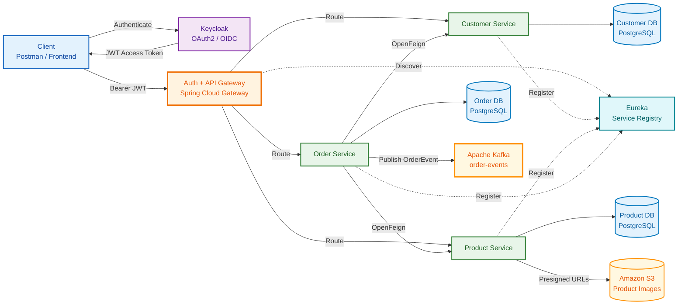
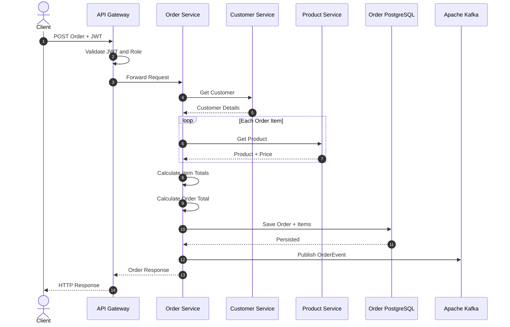
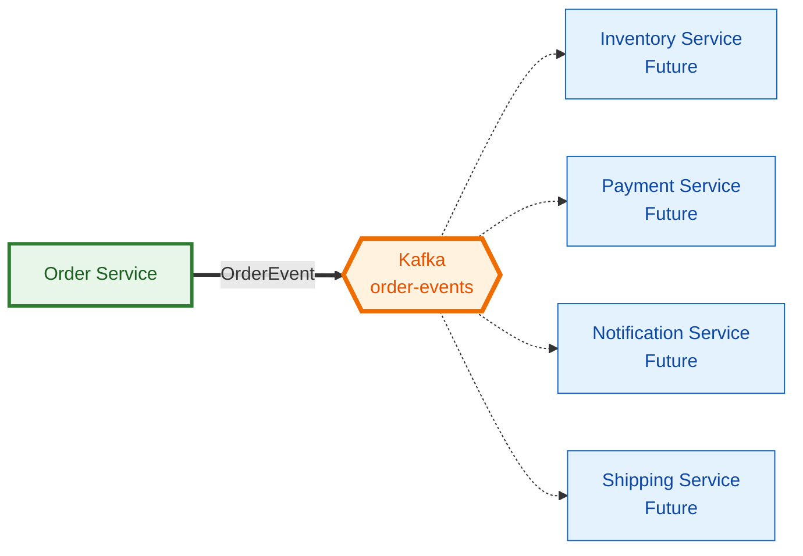
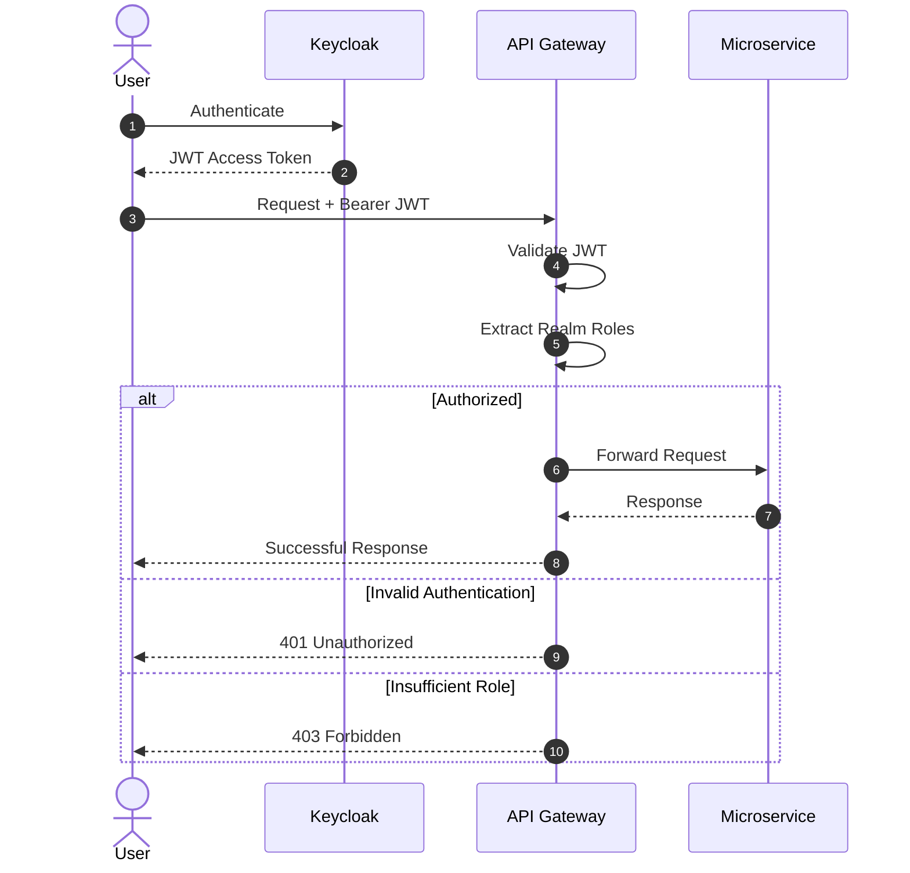
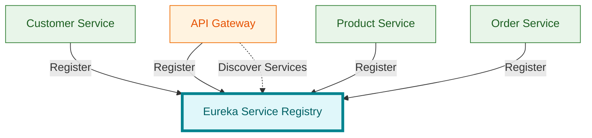
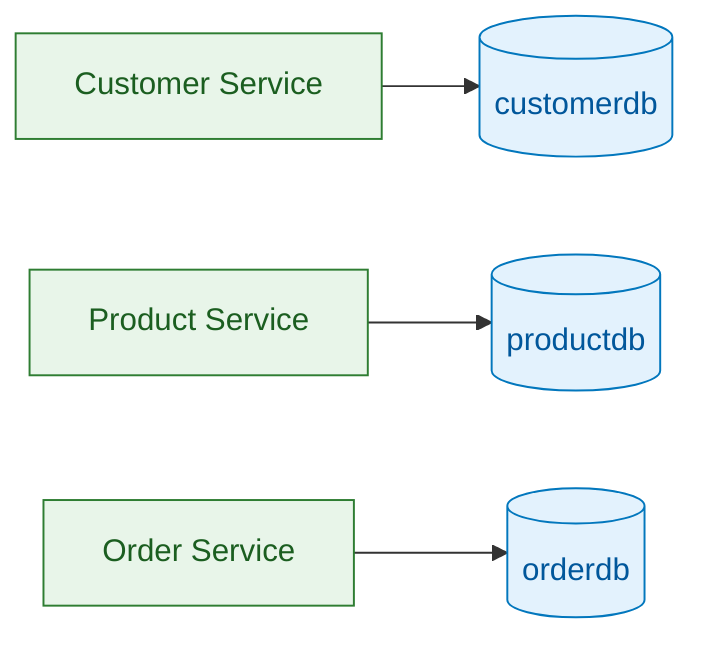

# Event-Driven-Secure-OAuth2-based-Ecommerce-Services

Refer to the below link

https://event-driven-oauth2-ecommerce-services-1ke6dsx1n-mhs18.vercel.app/workflow.html

An event-driven distributed e-commerce system built around independently deployable microservices, OAuth2/OIDC security, database-per-service data ownership, service discovery, asynchronous messaging, and private Amazon S3 object storage.

Customer, Product, and Order capabilities are separated into independent services with their own PostgreSQL databases. Keycloak provides centralized OAuth2/OIDC identity and RBAC, while Eureka provides service discovery. The Product Service uses Amazon S3 presigned URLs for secure product-image uploads and retrieval. The Order Service orchestrates synchronous service calls for customer and product data, persists transactional order state, and publishes domain events to Apache Kafka, enabling downstream workflows to evolve as loosely coupled event consumers.

# Deployment Overview

- The React frontend is deployed on **Vercel**.
- Customer Service, Product Service, Order Service, Auth and API Gateway, Eureka Service Registry, and Keycloak are deployed on **Render**.
- Apache Kafka is deployed on **Aiven**.
- Product images are stored in a private **Amazon S3** bucket and accessed using temporary presigned URLs.

## Cloud Deployment Instructions

Deploy the components in this order so each dependent service has a working URL before it starts:

1. PostgreSQL databases, Aiven Kafka, and the private S3 bucket
2. Keycloak
3. Eureka Service Registry
4. Customer, Product, and Order services
5. Auth and API Gateway
6. React frontend on Vercel

### 1. Provision the managed infrastructure

Create separate PostgreSQL databases for Customer, Product, Order, and Keycloak. Create an Aiven Kafka service and an `order-events` topic. Create a private Amazon S3 bucket and configure its CORS policy to allow the deployed frontend to use presigned upload and retrieval URLs.

Never commit database credentials, AWS credentials, Kafka credentials, or Keycloak secrets to this repository.

### 2. Deploy Keycloak on Render

Create a Render web service with:

| Setting | Value |
|---|---|
| Runtime | Docker |
| Root Directory | `keycloak-import` |
| Dockerfile | `./Dockerfile` |

Configure the Keycloak database variables required by the Docker image, including `KC_DB`, `KC_DB_URL`, `KC_DB_USERNAME`, and `KC_DB_PASSWORD`. Configure the bootstrap administrator credentials as protected Render environment variables.

After deployment, add the Vercel domain to the Keycloak client's valid redirect URIs and web origins. The callback path used by this application is:

```text
https://<your-vercel-domain>/auth/callback
```

### 3. Deploy Eureka Service Registry on Render

Create a Docker-based Render web service using `service-registry` as the root directory. Copy its public Render URL; the other backend services use it through:

```text
EUREKA_URL=https://<your-eureka-service>.onrender.com/eureka
```

### 4. Deploy the business services on Render

Create one Docker-based Render web service for each directory below.

#### Customer Service -- `customer-service`

```text
CUSTOMER_DB_URL=jdbc:postgresql://<host>:<port>/<database>
CUSTOMER_DB_USERNAME=<username>
CUSTOMER_DB_PASSWORD=<password>
KEYCLOAK_ISSUER_URI=https://<your-keycloak-service>.onrender.com/realms/ecommerce-app
KEYCLOAK_BASE_URL=https://<your-keycloak-service>.onrender.com
KEYCLOAK_REALM=ecommerce-app
KEYCLOAK_CLIENT_ID=<service-client-id>
KEYCLOAK_CLIENT_SECRET=<service-client-secret>
EUREKA_URL=https://<your-eureka-service>.onrender.com/eureka
```

#### Product Service -- `product-service`

```text
PRODUCT_DB_URL=jdbc:postgresql://<host>:<port>/<database>
PRODUCT_DB_USERNAME=<username>
PRODUCT_DB_PASSWORD=<password>
AWS_ACCESS_KEY_ID=<aws-access-key>
AWS_SECRET_ACCESS_KEY=<aws-secret-key>
AWS_REGION=eu-north-1
AWS_S3_BUCKET_NAME=<private-bucket-name>
EUREKA_URL=https://<your-eureka-service>.onrender.com/eureka
```

The AWS identity should receive only the S3 permissions required for this application's image objects.

#### Order Service -- `order-service`

```text
ORDER_DB_URL=jdbc:postgresql://<host>:<port>/<database>
ORDER_DB_USERNAME=<username>
ORDER_DB_PASSWORD=<password>
KAFKA_BOOTSTRAP_SERVERS=<aiven-host>:<aiven-port>
KAFKA_ORDER_TOPIC=order-events
KAFKA_SECURITY_PROTOCOL=SASL_SSL
KAFKA_SASL_MECHANISM=SCRAM-SHA-256
KAFKA_USERNAME=<aiven-username>
KAFKA_PASSWORD=<aiven-password>
EUREKA_URL=https://<your-eureka-service>.onrender.com/eureka
```

Download Aiven's CA certificate and add it to the Order Service as a Render secret file mounted at:

```text
/etc/secrets/ca.pem
```

### 5. Deploy Auth and API Gateway on Render

Create a Docker-based Render web service using `authandgatewayservice` as the root directory.

```text
JWK_SET_URI=https://<your-keycloak-service>.onrender.com/realms/ecommerce-app/protocol/openid-connect/certs
KEYCLOAK_REALM_URL=https://<your-keycloak-service>.onrender.com/realms/ecommerce-app
KEYCLOAK_CLIENT_ID=AuthFlowClient
FRONTEND_URL=https://<your-vercel-domain>
FRONTEND_CALLBACK_URL=https://<your-vercel-domain>/auth/callback
EUREKA_URL=https://<your-eureka-service>.onrender.com/eureka
CUSTOMER_SERVICE_URL=https://<your-customer-service>.onrender.com
PRODUCT_SERVICE_URL=https://<your-product-service>.onrender.com
ORDER_SERVICE_URL=https://<your-order-service>.onrender.com
```

Direct service URLs are shown because they are often more reliable than registry-based routing when Render services use public HTTPS endpoints.

### 6. Deploy the React frontend on Vercel

Import this repository into Vercel and set the root directory to `ecommerce frontend`. Configure:

```text
VITE_API_GATEWAY=https://<your-api-gateway>.onrender.com
VITE_KEYCLOAK_URL=https://<your-keycloak-service>.onrender.com
VITE_KEYCLOAK_REALM=ecommerce-app
VITE_KEYCLOAK_CLIENT_ID=AuthFlowClient
```

Redeploy the frontend after changing any `VITE_` variable because Vite embeds these values during the build.

### 7. Verify the deployment

1. Open the Eureka dashboard and confirm that Customer, Product, and Order services are registered.
2. Sign in through Keycloak from the Vercel frontend.
3. Verify product retrieval through the API Gateway.
4. As an administrator, request a presigned S3 upload URL and upload a product image.
5. Place an order and confirm that an `OrderEvent` reaches the Aiven `order-events` topic.

# Running the Project

## Prerequisites

Make sure the following are installed:

- Java
- Maven
- Docker Desktop
- Docker Compose
- Git

---

## 1. Clone the Repository

```bash
git clone https://github.com/ManjuAnand9/fullstack-deployed-event-driven-oauth2-ecommerce-services.git
```

Move into the project directory:

```bash
cd fullstack-deployed-event-driven-oauth2-ecommerce-services
```

---

## 2. Start Docker Infrastructure

Make sure Docker Desktop is running.

From the project root:

```bash
docker compose up
```

Docker Compose starts the PostgreSQL databases and Keycloak environment required by the application.

| Component | Host Port |
|---|---:|
| Customer PostgreSQL | `5433` |
| Product PostgreSQL | `5434` |
| Order PostgreSQL | `5435` |
| Keycloak PostgreSQL | `5436` |
| Keycloak | `8180` |

### Database Initialization

The repository contains sample database data under:

```text
db-init/
|-- customerdb.sql
|-- productdb.sql
`-- orderdb.sql
```

When PostgreSQL starts with a fresh database volume, these scripts automatically initialize the Customer, Product, and Order databases.

### Keycloak Initialization

The Keycloak realm configuration is stored under:

```text
keycloak-import/
`-- ecommerce-app-realm-sanitized.json
```

The realm is automatically imported when Keycloak starts.

Keycloak can be accessed at:

```text
http://localhost:8180
```

---

## 3. Start the Service Registry

Open another terminal from the project root:

```bash
cd service-registry
./mvnw spring-boot:run
```

The Eureka Service Registry allows the microservices to register and discover each other.

---

## 4. Start Customer Service

Open another terminal:

```bash
cd customer-service
./mvnw spring-boot:run
```

---

## 5. Start Product Service

Open another terminal:

```bash
cd product-service
./mvnw spring-boot:run
```

---

## 6. Start Order Service

Open another terminal:

```bash
cd order-service
./mvnw spring-boot:run
```

---

## 7. Start Auth and API Gateway

Open another terminal:

```bash
cd authandgatewayservice
./mvnw spring-boot:run
```

The API Gateway is the secured entry point for requests to the business services.

---

## 8. Authenticate and Test Role-Based Access with Keycloak

The imported Keycloak realm is preconfigured with the application realm roles:

```text
ADMIN
USER
```

A development ADMIN user is already available:

```text
Username: admin
Password: admin
Role: ADMIN
```

Use this account to obtain an ADMIN access token and test APIs that require the `ADMIN` role.

To test USER access, first create a customer using the Customer Service:

```http
POST /CUSTOMER-SERVICE/createcustomer
```

Customer creation creates the corresponding user in Keycloak. You can then authenticate using that customer's username/password to obtain a USER access token.

### Configure OAuth2 in Postman

In Postman, open:

```text
Authorization -> Type: OAuth 2.0 -> Get New Access Token
```

Configure the OAuth2 request:

| Setting | Value |
|---|---|
| Token Name | `ecommerce-token` |
| Grant Type | `Authorization Code` |
| Auth URL | `http://localhost:8180/realms/ecommerce%20app/protocol/openid-connect/auth` |
| Access Token URL | `http://localhost:8180/realms/ecommerce%20app/protocol/openid-connect/token` |
| Client ID | `AuthFlowClient` |
| Scope | `openid profile email` |
| Client Authentication | Use the configuration defined for `AuthFlowClient` |

Use the callback URL configured for the Keycloak client when setting the Postman Callback URL.

Click **Get New Access Token**. Keycloak will display the login page.

For ADMIN access, log in with:

```text
admin / admin
```

For USER access, log in using the credentials of a customer created through the Customer Service.

After authentication, click **Use Token**. Postman will automatically send the JWT with protected requests:

```http
Authorization: Bearer <access_token>
```

The gateway validates the JWT, extracts the Keycloak realm roles, and checks authorization before forwarding the request to the appropriate service.

You can verify the security behavior using both tokens:

| Request | Expected Result |
|---|---|
| ADMIN token -> ADMIN API | `200 / Success` |
| ADMIN token -> USER API | `200 / Success` if ADMIN is permitted |
| USER token -> USER API | `200 / Success` |
| USER token -> ADMIN-only API | `403 Forbidden` |
| Missing/invalid token -> Protected API | `401 Unauthorized` |

This allows both **OAuth2 authentication and role-based authorization (RBAC)** to be tested directly from Postman.

## Fresh Environment Reset

To completely remove the current database state and recreate the environment from the repository configuration:

```bash
docker compose down -v
docker compose up
```

This removes the existing Docker volumes.

On the next startup:

- `customer-init.sql` recreates Customer data
- `product-init.sql` recreates Product data
- `order-init.sql` recreates Order data
- The Keycloak realm JSON recreates the development authentication environment

> Use `docker compose down -v` only when you intentionally want to reset the local database state.

---

## Run Tests

Tests can be executed independently for each service.

For example:

```bash
cd customer-service
./mvnw clean test
```

```bash
cd product-service
./mvnw clean test
```

```bash
cd order-service
./mvnw clean test
```

Docker Desktop should be running when executing Testcontainers-based integration tests.

---

# System Architecture



The client does not communicate directly with the business services. Requests enter through the API Gateway, where authentication and authorization are enforced.

The Customer, Product, and Order services maintain independent databases. The Product Service manages private product images in Amazon S3 using presigned URLs. The Order Service communicates synchronously with Customer and Product services and asynchronously publishes order events to Kafka.

---

# Services

## Auth and API Gateway

The Auth and Gateway service provides the secured entry point into the application.

Responsibilities:

- OAuth2 Resource Server
- JWT validation
- Keycloak realm-role extraction
- Role-based authorization
- API routing
- Eureka service discovery
- Custom `401 Unauthorized` handling
- Custom `403 Forbidden` handling

---

## Customer Service

The Customer Service manages application customers and their relationship with Keycloak identities.

Responsibilities:

- Create customers
- Retrieve customers
- Paginated customer retrieval
- Store customer information
- Associate customers with Keycloak user IDs
- Request validation
- Exception handling

Database:

```text
customerdb
```

---

## Product Service

The Product Service manages the e-commerce product catalog.

Responsibilities:

- Add products
- Retrieve products
- Update products
- Paginated product retrieval
- Product pricing
- Private product-image storage in Amazon S3
- Presigned URLs for controlled image uploads and retrieval
- Validation
- Exception handling

Database:

```text
productdb
```

---

# Amazon S3 Product Images

Product images are stored in a private Amazon S3 bucket rather than being exposed publicly.

- Only an authenticated `ADMIN` can request a presigned upload URL and upload a product image.
- The Product Service generates short-lived presigned URLs instead of exposing AWS credentials to the frontend.
- Product-image retrieval uses temporary presigned URLs so objects can remain private.
- The browser uploads or retrieves the image directly from S3 using the generated URL.

AWS credentials, bucket name, and region must be supplied through environment variables and must not be committed to source control.

---

## Order Service

The Order Service coordinates order processing.

When an order is placed, it:

1. Retrieves customer information.
2. Retrieves product information.
3. Uses the current product prices.
4. Calculates individual item totals.
5. Calculates the complete order total.
6. Persists the order and order items.
7. Generates the order response.
8. Publishes an `OrderEvent` to Kafka.

Database:

```text
orderdb
```

---

# Order Processing Flow



This workflow combines synchronous and asynchronous communication.

---

# Synchronous Service Communication

The Order Service requires customer and product information while processing an order.

It therefore communicates synchronously using OpenFeign:

```text
                     +------------------+
                     | Customer Service |
                     +--------^---------+
                              |
                              | OpenFeign
                              |
+---------------+             |
| Order Service |-------------+
+---------------+             |
                              | OpenFeign
                              |
                     +--------v---------+
                     | Product Service  |
                     +------------------+
```

The Order Service does not directly access the Customer or Product databases.

Each service remains responsible for its own data.

---

# Event-Driven Communication

After an order is persisted, the Order Service publishes an `OrderEvent` to Apache Kafka.



Kafka provides an asynchronous integration point for downstream services.

For example, future Inventory, Payment, Notification, or Shipping services could consume order events without requiring the Order Service to call each service directly.

---

# Authentication and Authorization

Authentication is provided by Keycloak using OAuth2/OpenID Connect.



Keycloak realm roles are converted into Spring Security authorities.

The application uses roles such as:

```text
ADMIN
USER
```

This allows endpoint-level authorization such as:

```java
.hasRole("ADMIN")
```

and:

```java
.hasAnyRole("USER", "ADMIN")
```

---

# Service Discovery

The services register with Netflix Eureka.



This allows services to use logical service names instead of relying entirely on hard-coded service addresses.

---

# Database Architecture

The project follows the database-per-service pattern.



| Service | Database |
|---|---|
| Customer Service | `customerdb` |
| Product Service | `productdb` |
| Order Service | `orderdb` |
| Keycloak | `keycloakdb` |

Services communicate through APIs rather than directly accessing another service's database.

---

# Technology Stack

| Area | Technology |
|---|---|
| Language | Java |
| Backend | Spring Boot |
| API Gateway | Spring Cloud Gateway |
| Authentication | OAuth2 / OpenID Connect |
| Identity Provider | Keycloak |
| Authorization | Spring Security / RBAC |
| Service Discovery | Netflix Eureka |
| Service Communication | OpenFeign / REST |
| Event Streaming | Apache Kafka |
| Object Storage | Amazon S3 with presigned URLs |
| Database | PostgreSQL |
| Persistence | Spring Data JPA / Hibernate |
| Testing | JUnit, Mockito, MockMvc, Testcontainers |
| Build | Maven |
| Infrastructure | Docker / Docker Compose |
| Deployment | Vercel, Render, Aiven, AWS S3 |

---

# Validation and Error Handling

DTOs use Jakarta Bean Validation annotations including:

```java
@NotBlank
@NotEmpty
@Email
@Size
@Valid
```

Centralized exception handling provides consistent HTTP responses.

| Status | Meaning |
|---|---|
| `400` | Invalid request |
| `401` | Authentication required or invalid |
| `403` | User does not have required permission |
| `404` | Resource not found |
| `500` | Unexpected server error |

---

# Pagination

Collection APIs use Spring Data pagination rather than returning an unlimited number of records.

Example:

```http
GET /customers?page=0&size=20&sort=customerid,asc
```

Responses include:

```text
content
page number
page size
total elements
total pages
first
last
```

---

# Testing

The project contains multiple layers of automated testing.

### Unit Tests

JUnit and Mockito are used to test service-layer business logic in isolation.

### Controller Tests

MockMvc is used to test controller behavior and HTTP responses.

### Integration Tests

Testcontainers provides temporary PostgreSQL instances for integration tests, allowing persistence behavior to be tested against an actual PostgreSQL database.

### Kafka Integration Testing

The Order Service includes:

```text
OrderEventProducerIntegrationTest
```

to verify the Kafka event-publishing path.

---

# Project Structure

```text
fullstack-deployed-event-driven-oauth2-ecommerce-services/
|-- authandgatewayservice/
|   `-- OAuth2 security + API Gateway
|-- customer-service/
|   `-- Customer management
|-- product-service/
|   `-- Product catalog + Amazon S3 image management
|-- order-service/
|   `-- Order processing + Kafka producer
|-- service-registry/
|   `-- Eureka Service Registry
|-- ecommerce frontend/
|   `-- React + Vite frontend
|-- db-init/
|   |-- customerdb.sql
|   |-- productdb.sql
|   `-- orderdb.sql
|-- keycloak-import/
|   `-- ecommerce-app-realm-sanitized.json
|-- docker-compose.yml
`-- README.md
```

---

# Key Design Decisions

### API Gateway

Provides a single secured entry point and centralizes JWT validation and role-based authorization.

### Keycloak

Provides OAuth2/OIDC identity management instead of implementing authentication independently in every business service.

### Database per Service

Customer, Product, and Order services independently own their data.

### OpenFeign

Used when the Order Service requires customer or product information immediately during request processing.

### Kafka

Used after order creation to provide asynchronous communication and reduce coupling with future downstream services.

### Amazon S3

Stores product images privately while presigned URLs provide temporary, controlled upload and retrieval access without exposing AWS credentials to the client.

### Testcontainers

Allows integration tests to execute against real PostgreSQL containers rather than relying only on an in-memory database.

---

# Future Enhancements

The architecture can be extended with:

- Inventory Service consuming Kafka order events
- Payment Service
- Notification Service
- Shipping Service
- Kafka retry and dead-letter topics
- Resilience4j circuit breakers
- Redis caching
- Distributed tracing
- Centralized logging and monitoring
- OpenAPI / Swagger
- CI/CD pipeline

